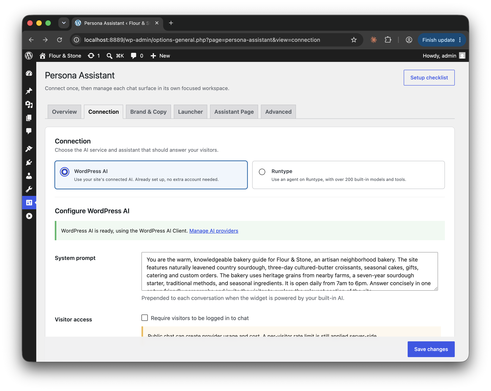
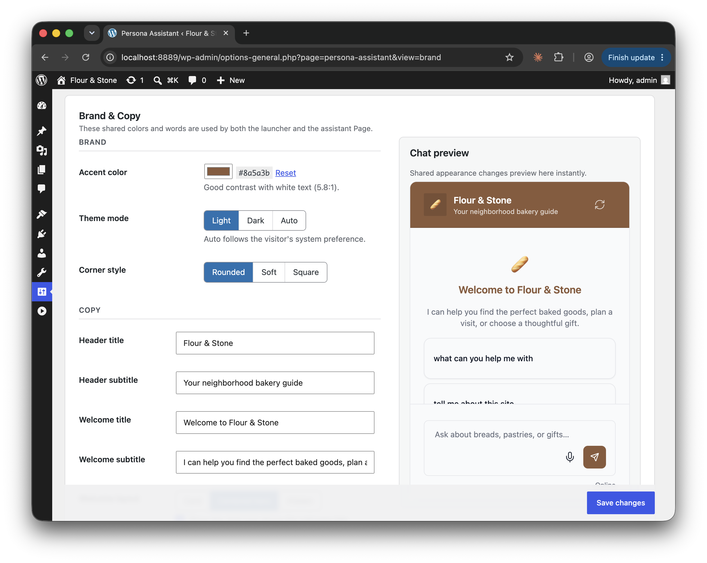
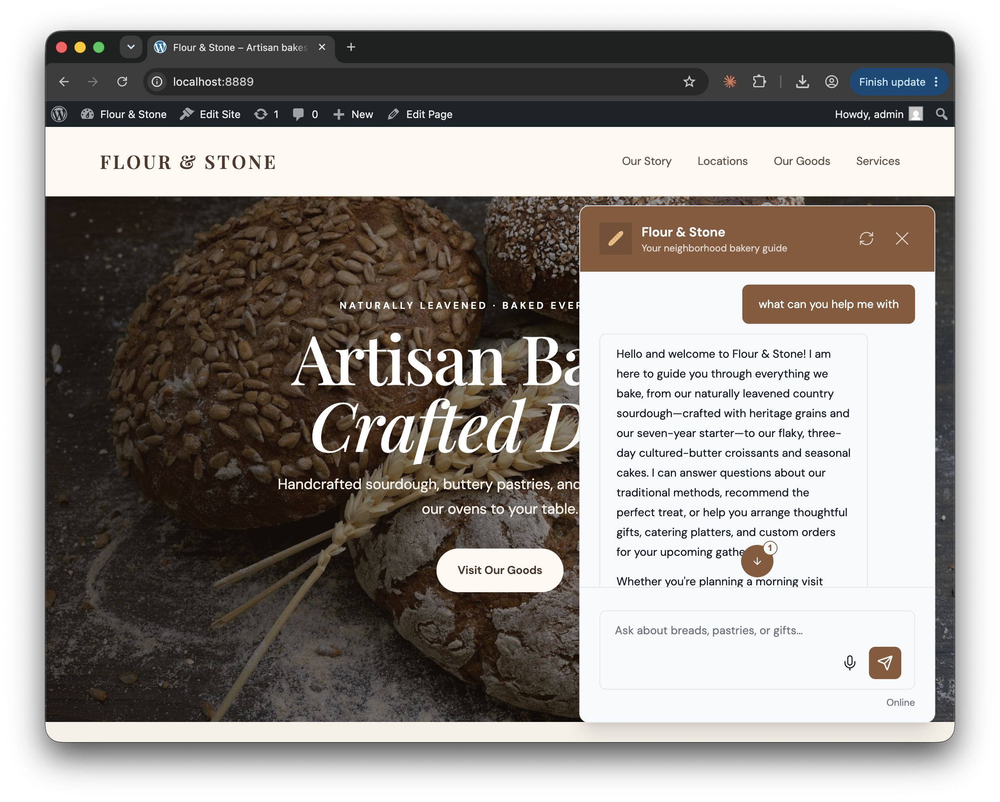
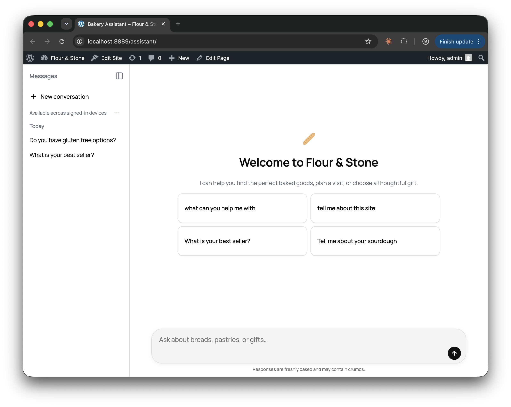

# Persona for WordPress (Community RC)

*This is the initial release!* Feedback in the form of issues, celebration, or contributions is greatly appreciated :)

This plugin unlocks two forms of customizable agent UIs on WordPress.
1) "Pill": A launcher on the page that pops open the chat on click
2) "Assistant": A full-screen assistant view that lives on a page

By default, everything uses built-in WordPress AI. It's a great testbed for the latest functionality. Optionally, you can also connect Runtype to unlock more models, tools, and WebMCP support.

Rendering utilizes [Persona.js](https://github.com/runtypelabs/persona) (MIT) to render the FE experiences. Because it's framework free Vanilla JS, what you customize will render on top of any WordPress site.

<table>
  <tr>
    <td align="center" width="50%">
      
       
      <em>AI Connection</em>
    </td>
    <td align="center" width="50%">
      
       
      <em>Brand & Copy</em>
    </td>
  </tr>
  <tr>
    <td align="center" width="50%">
      
       
      <em>Pill launcher</em>
    </td>
    <td align="center" width="50%">
      
       
      <em>Assistant Page</em>
    </td>
  </tr>
</table>

# Installation

1. Copy this folder into `wp-content/plugins/persona-assistant` (or install the zip).
2. Activate **Persona Assistant** on the Plugins screen.
3. Open **Settings → Persona Assistant** and follow the setup checklist: connect an AI, then choose a launcher, an assistant Page, or a manual embed.
4. Use the workspaces (Connection, Brand & Copy, Launcher, Assistant Page, Advanced) to customize each surface.

The repo root **is** the plugin. For a local WordPress, run `npm run env:start` from this folder. For a one-click sample site in the browser, see [Sample site (Playground)](docs/local-testing.md#sample-site-wordpress-playground).

# Documentation

- [Connecting AI](docs/connecting.md) — enabling WordPress AI or Runtype to power the experiences
- [Surfaces](docs/surfaces.md) — launcher, embeds, and the full-screen assistant Page
- [Customization](docs/customization.md) — admin workspaces and Persona config mapping
- [Page tools (WebMCP)](docs/webmcp.md)
- [Security](docs/security.md)
- [Developers](docs/developers.md) — constants, filters, and asset delivery
- [Architecture](docs/architecture.md) — file layout
- [Local testing](docs/local-testing.md) — wp-env, and a Playground sample site

The full index is in [`docs/`](docs/README.md).

# Contributing

Feedback, bug reports, documentation improvements, and pull requests are welcome! 🙌

- WordPress-specific functionality: this repo
- Persona.js library used to render agent UI: [Persona](https://github.com/runtypelabs/persona)

If this plugin or Persona itself is useful to you, consider giving them a star. 🤩

# License

This plugin is [GPL-2.0-or-later](https://www.gnu.org/licenses/gpl-2.0.html). The bundled Persona interface is MIT.
